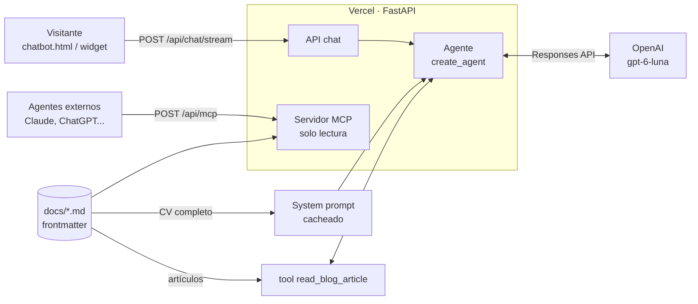
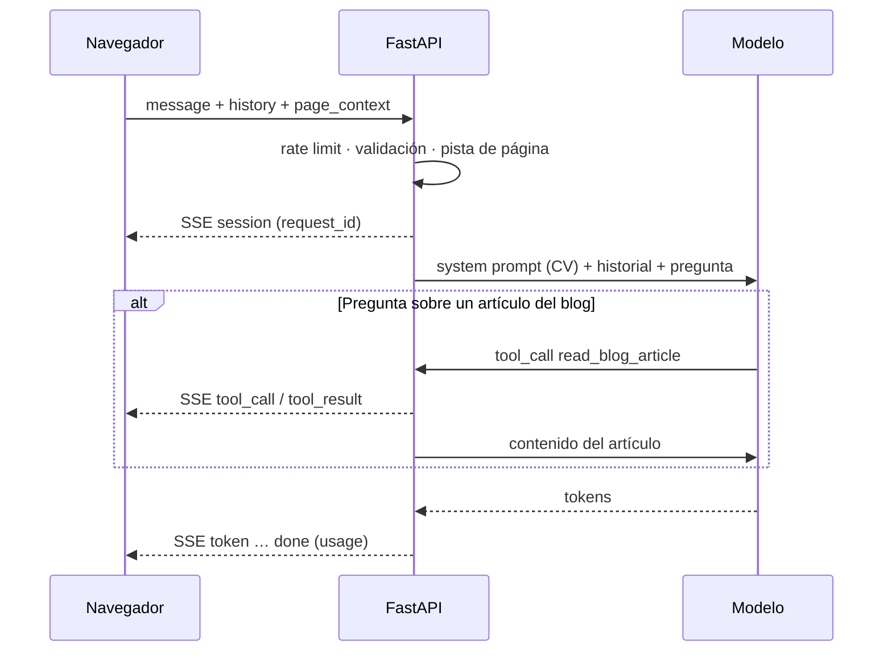

# Asistente del CV

Chatbot que responde sobre el CV y el blog de Demetrio Tahoces. Backend FastAPI + LangChain en Vercel; frontend estático en GitHub Pages (`CV/chatbot.html`).

## De un vistazo

| | |
| --- | --- |
| Modelo | OpenAI `gpt-6-luna` (Responses API, `reasoning_effort=medium`) |
| Conocimiento | CV completo en el system prompt (~7,6k tokens, con caché) + artículos del blog bajo demanda |
| Agente | `langchain.agents.create_agent` + middleware de límites |
| Estado | Ninguno en servidor: el cliente envía los últimos 10 mensajes |
| Extras | Servidor MCP de solo lectura, feedback 👍/👎, tracing opcional (LangSmith) |

## Arquitectura



## Flujo de una pregunta



Las preguntas sobre el CV se resuelven en **1 llamada** al modelo; las del blog en **2**.

## Endpoints

| Método | Ruta | Uso |
| --- | --- | --- |
| `POST` | `/api/chat/stream` | Respuesta en streaming (SSE). Lo usa el frontend |
| `POST` | `/api/chat` | Respuesta completa en JSON (fallback) |
| `POST` | `/api/feedback` | 👍/👎 de una respuesta (`request_id`, `rating`) |
| `GET` | `/api/health` | Estado, modelo y nº de documentos |
| `POST` | `/api/mcp` | Servidor MCP (Streamable HTTP, stateless, sin auth) |

Cuerpo de `/api/chat*`:

```json
{
  "message": "¿Y qué patrones usó allí?",
  "history": [{"role": "user", "content": "..."}, {"role": "assistant", "content": "..."}],
  "page_context": {"path": "/CV/opendit.html"}
}
```

Eventos SSE: `session` → `tool_call`* → `tool_result`* → `token`… → `done` (o `error`).

## Guardarraíles

| Riesgo | Control |
| --- | --- |
| Bucles de herramientas | `ModelCallLimitMiddleware` (3) · `ToolCallLimitMiddleware` (2) |
| Coste por llamada | `max_output_tokens=2000`, `timeout=30s`, límite de gasto en OpenAI |
| Abuso | Rate limit por IP (5/min, 20/h) · CORS solo para el dominio del CV |
| Prompt injection | Reglas fijas en el prompt · historial solo texto user/assistant · `page_context` solo por ruta conocida |
| Invención | Solo responde con la base de conocimiento; evals de «no inventar» |
| Privacidad | Sin texto del usuario en logs · IP como HMAC · `store=False` en OpenAI |

## Estructura

| Ruta | Qué hay |
| --- | --- |
| `api/index.py` | App FastAPI: endpoints, CORS, rate limit, montaje MCP |
| `core/agent.py` | Modelo, agente, middleware, streaming |
| `core/knowledge.py` | Carga de `docs/`, frontmatter, render del prompt, pista de página |
| `core/prompts.py` | Reglas del asistente + fecha |
| `core/tools.py` | Tool `read_blog_article` (solo blog) |
| `core/mcp_server.py` | Servidor MCP (`list_documents`, `get_document`) |
| `core/tracing.py` | LangSmith opcional + feedback |
| `core/llms_txt.py` | Genera `/llms.txt` del sitio |
| `docs/` | Base de conocimiento (Markdown) |
| `test/` | Tests offline (modelo falso, sin API key) |
| `evals/` | Dataset + evals contra el modelo real |

## Base de conocimiento

Cada `docs/**/*.md` lleva frontmatter:

| Campo | Ejemplo | Para qué |
| --- | --- | --- |
| `type` | `cv` · `formacion` · `blog_post` | CV/formación van enteros al prompt; `blog_post` va al índice |
| `title` | `Software Engineer en Fermax` | Título en prompt, MCP y `llms.txt` |
| `route` | `/CV/fermax.html` | URL pública para citar y pista de página |
| `summary` | `Experiencia actual (...)` | Índice del blog, MCP y `llms.txt` |
| `order` | `10` | Orden en el prompt (estable para la caché) |
| `date` | `"2026-07-05"` | Solo blog |
| `tags` | `["cv", "fermax"]` | Metadatos |

Tras añadir o cambiar un documento: `uv run python -m core.llms_txt` y `uv run pytest`.

## Configuración

| Variable | Defecto | Nota |
| --- | --- | --- |
| `API_KEY` | — | Obligatoria (OpenAI) |
| `MODEL_NAME` | `gpt-6-luna` | |
| `REASONING_EFFORT` | `medium` | `low` es ~0,6 s más rápido pero atribuye peor; `none` envía `temperature=0.3` |
| `MAX_OUTPUT_TOKENS` | `2000` | Incluye tokens de razonamiento |
| `MAX_MODEL_CALLS` / `MAX_TOOL_CALLS` | `3` / `2` | Por petición |
| `MAX_HISTORY_MESSAGES` | `10` | Mensajes previos aceptados |
| `RATE_LIMIT_PER_MINUTE` / `_PER_HOUR` | `5` / `20` | Por IP y por instancia |
| `ALLOWED_ORIGINS` | GitHub Pages + localhost | Separados por comas |
| `LANGSMITH_TRACING` / `_API_KEY` / `_PROJECT` | `false` | Tracing opcional |

Plantilla completa en [.env.example](.env.example).

## Desarrollo

```powershell
uv sync                                               # dependencias (uv.lock)
uv run uvicorn api.index:app --reload --port 3000    # API local
uv run pytest                                         # tests offline
uv run pytest -m evals                                # evals (gasta tokens)
```

| Comprobación | Qué valida | Coste |
| --- | --- | --- |
| `pytest` | Conocimiento, config, contexto de página, agente, API, CORS, rate limit, MCP, `llms.txt` | 0 |
| `pytest -m evals` | 31 casos (37 ejecuciones): hechos, honestidad, inyección, idioma, historial, blog. Juez: `gpt-6-sol` | Céntimos |
| CI (`.github/workflows/chatbot.yml`) | Tests en cada PR/push; evals en PR si existe el secreto `CHATBOT_API_KEY` | Céntimos por PR |

## Decisiones

| Decisión | Alternativa descartada | Por qué |
| --- | --- | --- |
| CV entero en el prompt (CAG) + tool para el blog | RAG por búsqueda de palabras clave | El corpus cabe (~7,6k tokens); 1 llamada en vez de 3-4 y sin fallos de recuperación |
| Historial enviado por el cliente | `MemorySaver` / Redis | Serverless sin estado ni fugas de memoria |
| `create_agent` + middleware | `create_react_agent` | Deprecado; se elimina en LangGraph 2.0 |
| MCP stateless en la misma app | Servicio aparte | Spec MCP 2026-07-28 sin sesión; coste cero en tokens |
| `uv.lock` + Python 3.14 | `requirements.txt` con `>=` | Builds reproducibles en Vercel |

## Despliegue

Vercel (preset FastAPI, raíz `CV/Chatbot`) instala con `uv` desde `pyproject.toml` + `uv.lock`. Cada PR genera un preview; `main` publica en `https://demetrio-tahoces-cv-chatbot.vercel.app`. No añadas rewrites en Vercel: FastAPI ya enruta `/api/*`.
