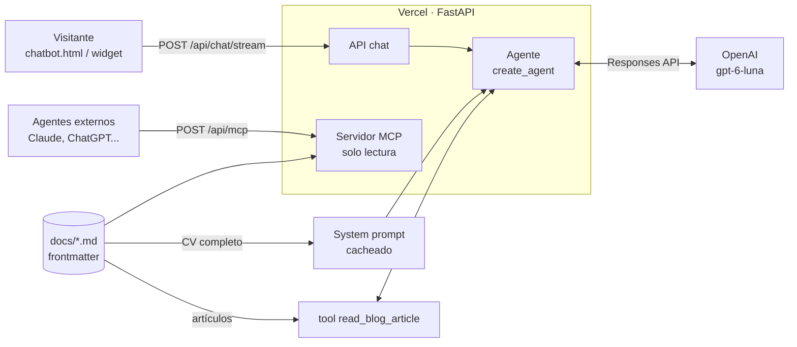
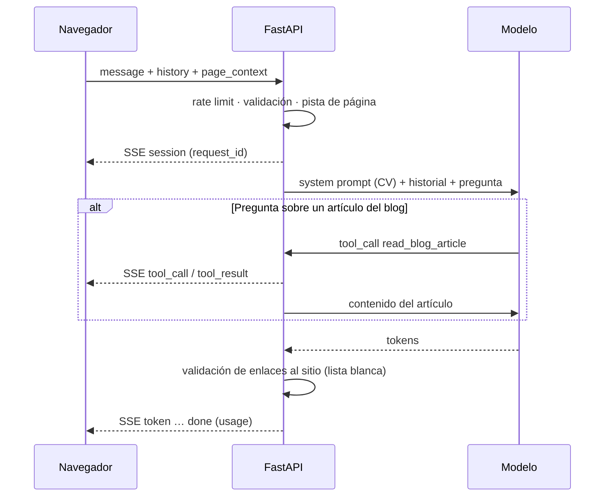

# Asistente del CV

Chatbot que responde sobre el CV y el blog de Demetrio Tahoces. Backend FastAPI + LangChain en Vercel; frontend estático en GitHub Pages (`CV/chatbot.html`).

## De un vistazo

| | |
| --- | --- |
| Modelo | OpenAI `gpt-6-luna` (Responses API, `reasoning_effort=medium`) |
| Conocimiento | CV completo en el system prompt, dividido en secciones con su URL (~9,5k tokens, con caché) + artículos del blog bajo demanda |
| Citas | Cada párrafo enlaza a la sección de la web que lo respalda (`[↗ Sección](url#ancla)`); el backend valida cada enlace |
| Agente | `langchain.agents.create_agent` + middleware de límites |
| Estado | Ninguno en servidor: el cliente envía los últimos 10 mensajes |
| Extras | Servidor MCP de solo lectura, feedback 👍/👎, tracing opcional (LangSmith) |

## Arquitectura



## Flujo de una pregunta



Las preguntas sobre el CV se resuelven en **1 llamada** al modelo; las del blog en **2**.

## Endpoints

| Método | Ruta | Uso |
| --- | --- | --- |
| `POST` | `/api/chat/stream` | Respuesta en streaming (SSE). Lo usa el frontend |
| `POST` | `/api/chat` | Respuesta completa en JSON (fallback) |
| `POST` | `/api/feedback` | 👍/👎 de una respuesta (`request_id`, `rating`) |
| `GET` | `/api/health` | Estado, modelo y nº de documentos |
| `POST` | `/api/mcp` | Servidor MCP (Streamable HTTP, stateless, sin auth) |

Cuerpo de `/api/chat*`:

```json
{
  "message": "¿Y qué patrones usó allí?",
  "history": [{"role": "user", "content": "..."}, {"role": "assistant", "content": "..."}],
  "page_context": {"path": "/CV/opendit.html"}
}
```

Eventos SSE: `session` → `tool_call`* → `tool_result`* → `token`… → `done` (o `error`).

## Guardarraíles

| Riesgo | Control |
| --- | --- |
| Bucles de herramientas | `ModelCallLimitMiddleware` (3) · `ToolCallLimitMiddleware` (2) |
| Coste por llamada | `max_output_tokens=2000`, `timeout=30s`, límite de gasto en OpenAI |
| Abuso | Rate limit por IP (5/min, 20/h) · CORS solo para el dominio del CV · bloqueo temporal por consultas malintencionadas reiteradas (ver abajo) |
| Prompt injection | Reglas fijas en el prompt · historial solo texto user/assistant · `page_context` solo por ruta conocida |
| Invención | Solo responde con la base de conocimiento; evals de «no inventar» |
| Enlaces inventados | `core/citations.py` reescribe todo enlace al sitio a su URL canónica: ancla desconocida → página; página desconocida → sin enlace. También en streaming |
| Privacidad | Sin texto del usuario en logs · IP como HMAC · `store=False` en OpenAI |

## Estructura

| Ruta | Qué hay |
| --- | --- |
| `api/index.py` | App FastAPI: endpoints, CORS, rate limit, bloqueo por abuso, montaje MCP |
| `core/agent.py` | Modelo, agente, middleware, streaming |
| `core/knowledge.py` | Carga de `docs/`, frontmatter, secciones con ancla, lista blanca de URLs, render del prompt, pista de página |
| `core/citations.py` | Validación de enlaces al sitio (respuesta completa y streaming) |
| `core/prompts.py` | Reglas del asistente + fecha |
| `core/abuse_classifier.py` | Clasificador de intención maliciosa (structured output) |
| `middleware/abuse_guard.py` | Strikes y bloqueo temporal por `HMAC(ip)` en Upstash Redis |
| `core/tools.py` | Tool `read_blog_article` (solo blog) |
| `core/mcp_server.py` | Servidor MCP (`list_documents`, `get_document`) |
| `core/tracing.py` | LangSmith opcional + feedback |
| `core/llms_txt.py` | Genera `/llms.txt` del sitio |
| `docs/` | Base de conocimiento (Markdown) |
| `test/` | Tests offline (modelo falso, sin API key) |
| `evals/` | Dataset + evals contra el modelo real |

## Base de conocimiento

Cada `docs/**/*.md` lleva frontmatter:

| Campo | Ejemplo | Para qué |
| --- | --- | --- |
| `type` | `cv` · `formacion` · `blog_post` | CV/formación van enteros al prompt; `blog_post` va al índice |
| `title` | `Software Engineer en Fermax` | Título en prompt, MCP y `llms.txt` |
| `route` | `/CV/fermax.html` | URL pública para citar y pista de página |
| `summary` | `Experiencia actual (...)` | Índice del blog, MCP y `llms.txt` |
| `order` | `10` | Orden en el prompt (estable para la caché) |
| `date` | `"2026-07-05"` | Solo blog |
| `tags` | `["cv", "fermax"]` | Metadatos |

Cada encabezado declara el `id` de la sección HTML que respalda: `## Contexto {#contexto}`. Los `###` sin ancla heredan la de su `##`; un encabezado sin texto propio (p. ej. `## Contribuciones`) se agrupa con la sección siguiente. En el prompt cada sección va como `<seccion url="https://…/CV/fermax.html#contexto">`, y esas URLs (más las páginas) forman la lista blanca de enlaces.

Si cambias o añades una sección en el HTML o en el Markdown, mantén ambos sincronizados: `test_citations.py` falla si un ancla declarada no existe como `id` en su página o si una sección queda sin ancla.

Tras añadir o cambiar un documento: `uv run python -m core.llms_txt` y `uv run pytest`.

## Configuración

| Variable | Defecto | Nota |
| --- | --- | --- |
| `API_KEY` | — | Obligatoria (OpenAI) |
| `MODEL_NAME` | `gpt-6-luna` | |
| `REASONING_EFFORT` | `medium` | `low` es ~0,6 s más rápido pero atribuye peor; `none` envía `temperature=0.3` |
| `MAX_OUTPUT_TOKENS` | `2000` | Incluye tokens de razonamiento |
| `MAX_MODEL_CALLS` / `MAX_TOOL_CALLS` | `3` / `2` | Por petición |
| `MAX_HISTORY_MESSAGES` | `10` | Mensajes previos aceptados |
| `RATE_LIMIT_PER_MINUTE` / `_PER_HOUR` | `5` / `20` | Por IP y por instancia |
| `ABUSE_MODE` | `log-only` | `off` (sin clasificador) · `log-only` (registra strikes, no bloquea) · `block` |
| `ABUSE_MAX_STRIKES` / `ABUSE_STRIKE_WINDOW_HOURS` | `3` / `24` | Strikes dentro de la ventana deslizante que provocan el bloqueo |
| `ABUSE_BLOCK_MINUTES` | `60` | Duración del bloqueo (`403` + `Retry-After`) |
| `ABUSE_CLASSIFIER_MODEL` / `_REASONING_EFFORT` | `MODEL_NAME` / `low` | Modelo del clasificador; conviene uno pequeño |
| `UPSTASH_REDIS_REST_URL` / `_TOKEN` | — | Store compartido (también acepta `KV_REST_API_URL` / `_TOKEN`). Sin él: fail-open, nadie se bloquea |
| `ALLOWED_ORIGINS` | GitHub Pages + localhost | Separados por comas |
| `LANGSMITH_TRACING` / `_API_KEY` / `_PROJECT` | `false` | Tracing opcional |

Plantilla completa en [.env.example](.env.example).

## Bloqueo temporal por abuso

Capa disuasoria, no una barrera de seguridad: el prompt ya declina las inyecciones; esto corta a quien insiste.

1. En `/api/chat` y `/api/chat/stream`, si `HMAC(ip)` tiene un bloqueo activo → `403` con `Retry-After` y `{"error": "temporarily_blocked", "message", "retry_after"}`. El frontend muestra el tiempo restante y no vuelve a llamar hasta que expire.
2. Si no, un clasificador aparte (`core/abuse_classifier.py`) evalúa **solo el mensaje actual** en paralelo con el agente (no añade latencia ni toca el prompt cacheado): `prompt_injection`, `prompt_extraction`, `abuse` o `none`. Fuera de ámbito, pedir código o preguntar qué es un prompt injection es `none`.
3. Cada mensaje malicioso suma un strike en un sorted set de Redis (ventana deslizante de `ABUSE_STRIKE_WINDOW_HOURS`). Al llegar a `ABUSE_MAX_STRIKES` se crea la clave de bloqueo con TTL `ABUSE_BLOCK_MINUTES` y se limpian los strikes.
4. Logs: `Abuse strike` / `Abuse block` con `ip_hash`, `abuse_category` y `strikes`; nunca el texto.

`/api/feedback` y `/api/mcp` no se bloquean: no gastan tokens del modelo. Cualquier fallo del store o del clasificador es fail-open.

Puesta en marcha: crear un Upstash Redis (Vercel → Storage/Marketplace, inyecta `KV_REST_API_*`), dejar `ABUSE_MODE=log-only` unos días, revisar los `Abuse strike` en los logs para medir falsos positivos y pasar a `block`. Limitaciones: la IP se cambia fácil (VPN) y una NAT compartida (oficina, universidad) puede penalizar a usuarios legítimos. En Vercel la IP sale de `x-real-ip`/`x-forwarded-for` (los fija el edge); fuera de Vercel, de la conexión.

## Desarrollo

```powershell
uv sync                                               # dependencias (uv.lock)
uv run uvicorn api.index:app --reload --port 3000    # API local
uv run pytest                                         # tests offline
uv run pytest -m evals                                # evals (gasta tokens; solo a mano)
```

| Comprobación | Qué valida | Coste |
| --- | --- | --- |
| `pytest` | Conocimiento, config, contexto de página, agente, API, CORS, rate limit, MCP, `llms.txt`, anclas Markdown ↔ HTML, validación de enlaces | 0 |
| `pytest -m evals` | 35 casos (44 ejecuciones): hechos, honestidad, inyección, idioma, historial, blog, citas. 22 casos del clasificador de abuso (`maliciosa`); `-k abuso` los ejecuta solos (~35 s). Métricas de citas: validez (URL exacta, antes de la validación) ≥ 80 % y cobertura de párrafos ≥ 70 %. Juez: `gpt-6-luna` | Céntimos |
| CI (`.github/workflows/chatbot.yml`) | Tests offline en cada PR/push | 0 |
| Evals manuales (`.github/workflows/chatbot-evals.yml`) | `pytest -m evals` con el secreto `CHATBOT_API_KEY`, solo al lanzarlo a mano desde Actions | Por ejecución |

Las evals nunca se ejecutan de forma automática: solo las lanza un humano, en local o desde Actions → *Chatbot evals* → *Run workflow*. Ningún agente, pipeline ni automatización debe ejecutarlas.

## Decisiones

| Decisión | Alternativa descartada | Por qué |
| --- | --- | --- |
| CV entero en el prompt (CAG) + tool para el blog | RAG por búsqueda de palabras clave | El corpus cabe (~7,6k tokens); 1 llamada en vez de 3-4 y sin fallos de recuperación |
| Historial enviado por el cliente | `MemorySaver` / Redis | Serverless sin estado ni fugas de memoria |
| `create_agent` + middleware | `create_react_agent` | Deprecado; se elimina en LangGraph 2.0 |
| MCP stateless en la misma app | Servicio aparte | Spec MCP 2026-07-28 sin sesión; coste cero en tokens |
| `uv.lock` + Python 3.14 | `requirements.txt` con `>=` | Builds reproducibles en Vercel |
| Anclas declaradas en el Markdown (`{#id}`) | Slugs derivados del título | Un cambio de título no rompe citas; el test de consistencia detecta desincronizaciones |
| Validación de enlaces token a token (se retiene solo el enlace en curso) | Validar al final | El streaming sigue fluyendo y nunca llega un enlace sin validar |
| Clasificador aparte en paralelo | Flag en la salida del agente | No altera el prompt cacheado ni el streaming y no añade latencia; se puede usar un modelo pequeño |
| Citas en la ventana principal (`target=_top`); enlaces externos en otra pestaña | Abrir las citas en otra pestaña o dentro del iframe | La cita lleva a la sección citada sin salir de la web; el widget restaura abierto el chat y su historial (localStorage) tras navegar |

## Despliegue

Vercel (preset FastAPI, raíz `CV/Chatbot`) instala con `uv` desde `pyproject.toml` + `uv.lock`. Cada PR genera un preview; `main` publica en `https://demetrio-tahoces-cv-chatbot.vercel.app`. No añadas rewrites en Vercel: FastAPI ya enruta `/api/*`.
